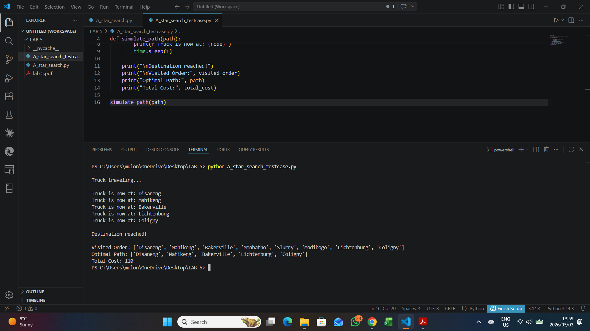

# A* Route Optimization in Python

A professional artificial intelligence pathfinding project that implements the A* search algorithm to identify an optimized route across weighted geographic locations. The project demonstrates heuristic search, cost-based decision making, and route simulation using Python.

## Project Overview

A* search is a widely used informed search algorithm for route planning, robotics, game AI, logistics, and navigation systems. This project applies A* to a weighted graph of locations and calculates an efficient route from `Disaneng` to `Coligny`.

The project includes:

- Weighted graph representation of connected locations
- Heuristic estimates toward the destination
- A* pathfinding implementation
- Optimal route reconstruction
- Visited-node tracking
- Simple route simulation output

## Repository Structure

```text
astar-route-optimization-python/
├── assets/
│   └── screenshots/
│       └── command-output.png
├── src/
│   ├── astar_search.py
│   └── route_simulation.py
├── requirements.txt
├── .gitignore
└── README.md
```

## Technologies Used

- Python
- Heap queue priority scheduling
- Graph search algorithms
- Heuristic optimization
- Artificial Intelligence pathfinding

## Installation

Clone the repository.

```bash
git clone https://github.com/mulondimbodi/astar-route-optimization-python.git
cd astar-route-optimization-python
```

This project uses only Python standard library modules, so no third-party packages are required.

## Usage

### Run the A* route optimization algorithm

```bash
python src/astar_search.py
```

### Run the route simulation

```bash
python src/route_simulation.py
```

## Example Output

The script prints:

- Start location
- Goal location
- Visited node order
- Optimal path
- Total route cost

### Command-line result



## How A* Search Works

A* evaluates each possible route using:

```text
f(n) = g(n) + h(n)
```

Where:

- `g(n)` is the actual cost from the start node to the current node
- `h(n)` is the estimated heuristic cost from the current node to the goal
- `f(n)` is the estimated total route cost

This allows the algorithm to prioritize routes that are both low-cost so far and promising toward the goal.

## AI and Data Science Relevance

This project demonstrates practical AI and analytical programming skills including:

- Implementing informed search from first principles
- Modeling real-world locations as weighted graph data
- Applying heuristics to optimize pathfinding decisions
- Tracking algorithm exploration behavior
- Simulating route movement from computed results
- Structuring reusable Python code for portfolio presentation

## Future Improvements

- Add graph visualization with highlighted optimal route
- Add command-line arguments for custom start and goal locations
- Compare A* with Dijkstra's algorithm
- Add unit tests for path and cost validation
- Export route results to CSV or JSON
- Build an interactive map-based route planner

## Author

Created by Mulondi Mbodi as part of a professional Artificial Intelligence and Data Science portfolio.
